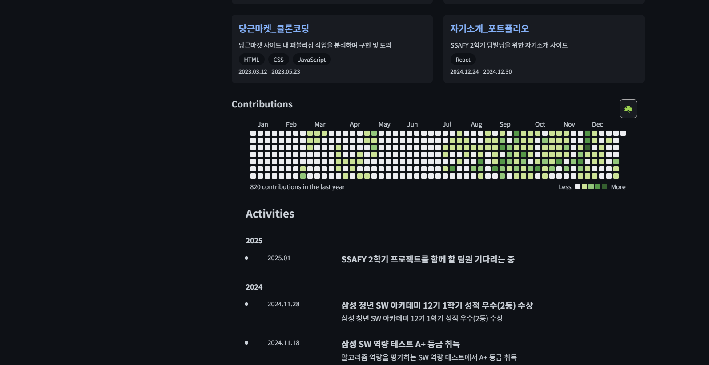
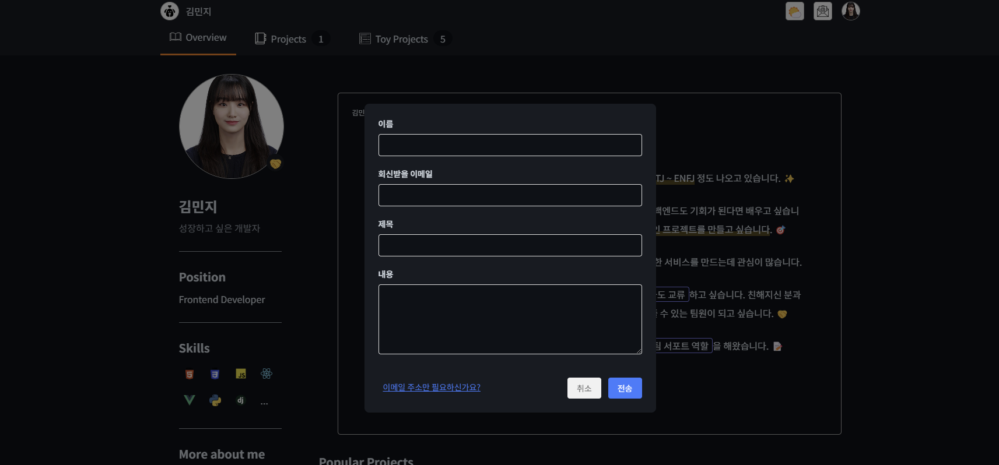
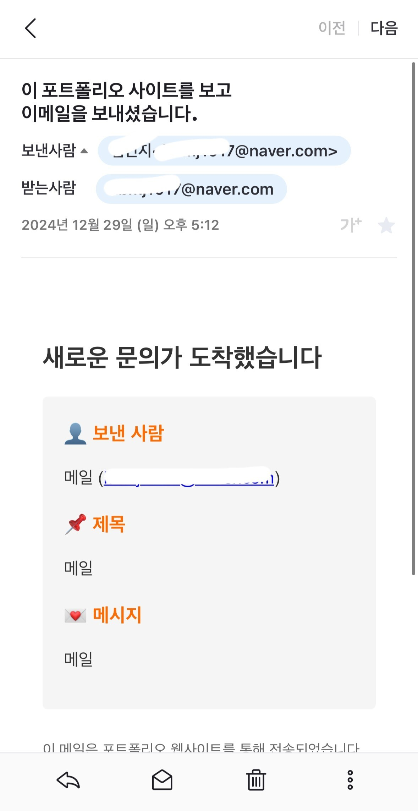

# 자기소개 포트폴리오 사이트

SSAFY 12기 2학기를 위한 자기소개 포트폴리오 사이트입니다. Context API를 활용한 상태 관리와 다크/라이트 모드를 지원하는 반응형 포트폴리오 웹사이트입니다.

## 프로젝트 개요

### 개발 동기
- 본 프로젝트는 SSAFY 2학기 팀빌딩을 위한 자기소개 준비의 일환으로 시작되었습니다.

- 프론트엔드 개발자로서의 기술적 역량을 효과적으로 전달하고, 지금까지의 프로젝트 경험을 체계적으로 정리하기 위한 목적으로 개발되었습니다.

### 주요 기능

- Context API를 활용하여 개인 정보 및 프로젝트 목록 데이터를 전역적으로 관리함으로써 효율적인 상태 관리 구현

- CSS :root 변수와 theme 시스템을 활용한 다크 모드/라이트 모드 테마 전환 기능 구현

- react-github-calendar 라이브러리를 통한 실시간 GitHub 활동 내역 시각화

- emailjs 서비스 연동을 통한 실시간 이메일 문의 기능 구현

### 기술 스택

#### 프레임워크 및 라이브러리

- Vite

- React

- React Router DOM

- EmailJS

- react-github-calendar

#### 주요 개발 도구

- Vite glob: 프로젝트 내 이미지 에셋 동적 관리

## 시작하기

### 필요 조건

- Node.js 20.18.0

- npm 10.2.0 이상 권장

### 종속성

```json
{
  "dependencies": {
    "@emailjs/browser": "^4.4.1",
    "react": "^18.3.1",
    "react-dom": "^18.3.1",
    "react-github-calendar": "^4.5.2",
    "react-router-dom": "^7.1.1"
  }
}
```

### 설치 방법

```bash
# 저장소 복제
git clone https://github.com/minjeeki/Portfolio.git

# 프로젝트 폴더로 이동
cd portfolio-site

# 종속성 설치
npm install

# 개발 서버 실행
npm run dev
```

### 프로젝트 구조

```
src/
├── components/    # 재사용 가능한 UI 컴포넌트
├── data/          # 프로젝트 정보, 개인 정보 등의 정적 데이터 파일
├── hooks/         # Context API를 활용한 커스텀 훅 (페이지별 title 변경 등등)
├── pages/         # 라우팅에서 사용되는 페이지 컴포넌트
└── styles/        # 스타일 파일
```

## 주요 기능

### 테마 시스템 (다크모드 / 라이트모드)

- Github 스타일의 테마 시스템 구현

- CSS 변수를 활용한 일관된 디자인 시스템

- 로컬 스토리지를 통한 사용자 테마 설정 유지

```css
/* 다크모드 (기본) */
:root {
  --bg-primary: #0d1117;
  --text-primary: #c9d1d9;
  --accent-color: #58a6ff;
}

/* 라이트모드 */
:root[data-theme='light'] {
  --bg-primary: #ffffff;
  --text-primary: #24292f;
  --accent-color: #0969da;
}
```

### Context API를 활용한 전역 상태 관리

- `data` 디렉토리의 정적 데이터를 3개의 Context (User, Project, Theme)를 활용해 전역적으로 관리
- 프로필 데이터와 프로젝트 데이터을 분리 관리해 유지 보수성 향상

```jsx
// App.jsx
<ThemeContext.Provider value={{ theme, toggleTheme }}>
  <UserContext.Provider value={{ user, setUser }}>
    <ProjectContext.Provider value={{ projects, setProjects }}>
      {/* 라우트 구성 */}
    </ProjectContext.Provider>
  </UserContext.Provider>
</ThemeContext.Provider>
```

### Github 활동 그래프 커스터마이징



- react-github-calendar를 활용한 GitHub 커밋 히스토리 시각화

- 3가지 테마(default, solvedAc, alternative) 가중치 기반 랜덤 테마 변경 기능

- 추가 구현 필요 : 툴팁 커스터마이징, 테마 선택 기능, 커밋 수 표시 기능


```jsx
const themes = {
  default: {
    light: ['#161b22', '#0e4429', '#006d32', '#26a641', '#39d353'],
    dark: ['#ebedf0', '#c6e48b', '#7bc96f', '#239a3b', '#196127']
  },
  // ... 추가 테마
};
```

### EmailJS 기반 이메일폼




- 모달 형식의 이메일 폼 구현

- 환경 변수를 통한 보안 키 관리

- 이메일 주소 복사 기능 지원

```jsx
const handleSubmit = async (e) => {
  e.preventDefault();
  try {
    await emailjs.send(
      import.meta.env.VITE_EMAILJS_SERVICE_ID,
      import.meta.env.VITE_EMAILJS_TEMPLATE_ID,
      {
        name: formData.name,
        reply_to: formData.email,
        title: formData.title,
        message: formData.message,
        time: currentTime
      },
      import.meta.env.VITE_EMAILJS_PUBLIC_KEY
    );
    // ... 성공 처리
  } catch (error) {
    // ... 에러 처리
  }
};
```

### 라우팅 구성 및 주요 컴포넌트

- react-router-dom을 활용한 SPA 구현

- 5개의 메인 페이지 구성:

  - Overview (메인) : 프로필, 기술스택, 활동 (교육, 수상, 자격증), 주요 프로젝트 소개 등의 컴포넌트 구현

  - Team Projects (팀 프로젝트) : 팀 프로젝트 소개 및 상세 페이지 구현

  - Toy Projects (개인 프로젝트) : 개인 프로젝트 소개 및 상세 페이지 구현

  - Components (컴포넌트) : `미구현`

- About Me (자기소개) : `미구현`

- NotFound 페이지 구현 : Canvas API를 활용한 그림판 404 페이지 구현 `수정 필요`

## 트러블 슈팅

## 참고 자료